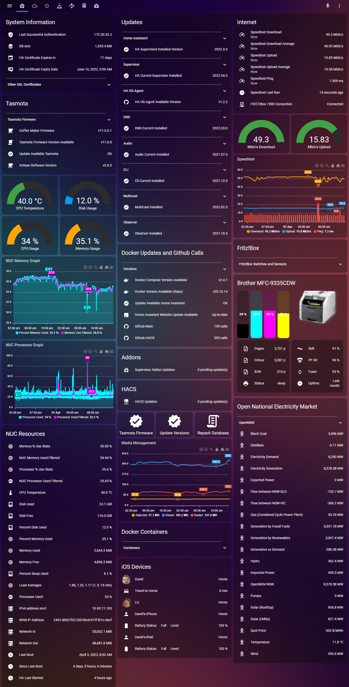
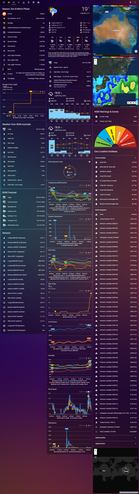
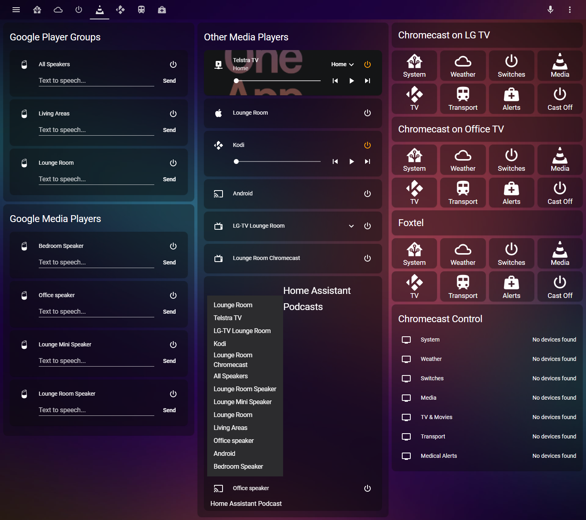
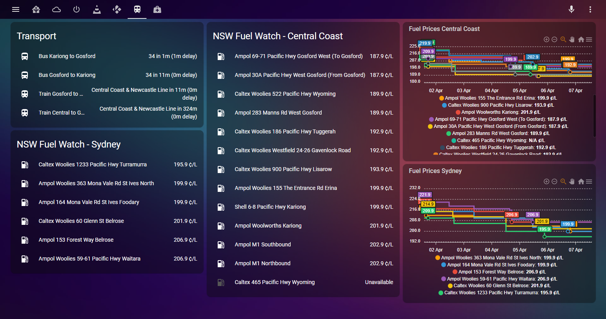

# home-assistant
My Home Assistant Settings

My Home Assistant has the following devices:

LimitlessLED Lights
Yeelights
Xiaomi WiFi switches
Wemo Switches
Sonoff Switches with Tasmota firmware
Media Devices
Google Assistant integration
Speedtest and Filter
Customised sun.py showing daylight yesterday, today & tomorrow, Sunset/sunrise today and next
and many more.

Here's what the screens look like right now:

Note that the alarm notification and Recycle Bin are on conditional cards and only show when needed

